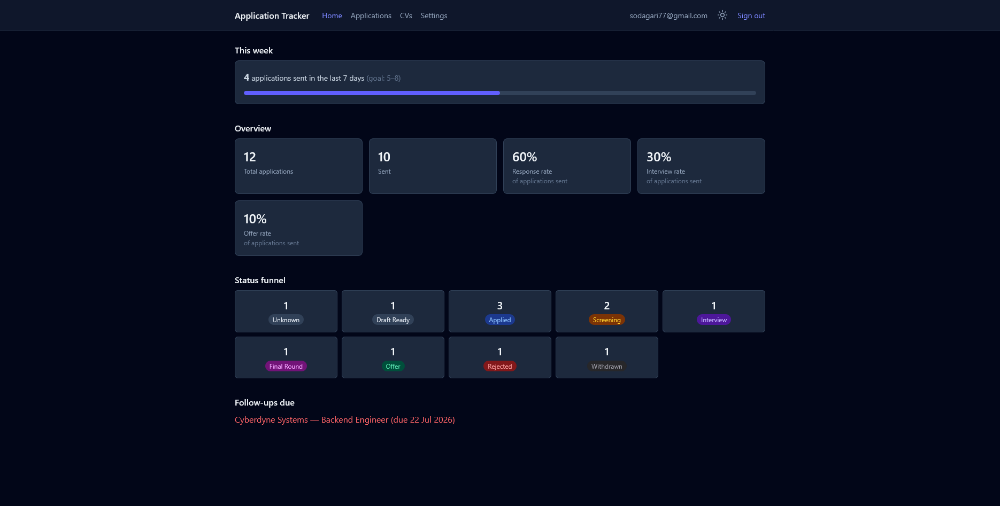
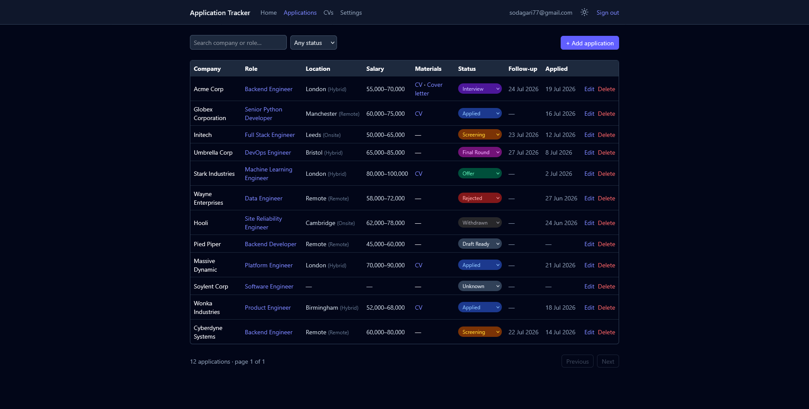
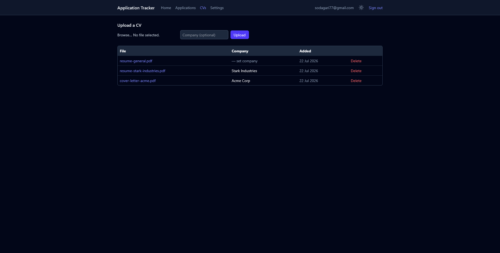
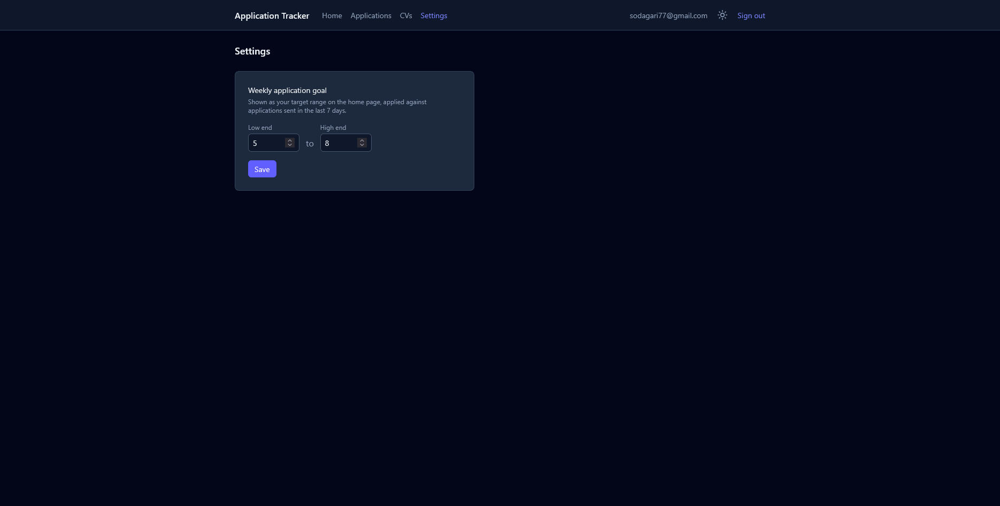
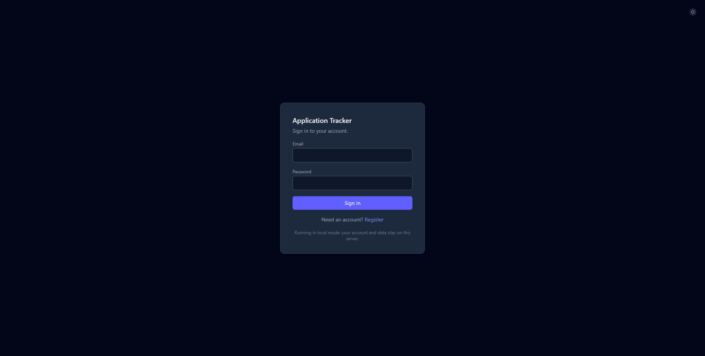

<div align="center">

# Application Tracker

A self-hostable job application tracker for one or more accounts. Track every application from
draft to offer, attach the CV and cover letter you sent, and see your progress at a glance.


**[Live demo](https://tracker.rostamsodagari.tech)**

</div>

## Why this exists

Spreadsheets don't tell you your response rate. Job boards don't remember which CV you sent
where. This is a small, focused tool that does exactly one job well: keep track of every
application you've sent, what you sent it with, and what happened next.

It runs two ways, chosen by a single setting:

- **Local mode** (default) — a SQLite file on your own machine, no external account, no signup
  anywhere else. Works the moment you clone the repo.
- **Appwrite mode** — plug in an Appwrite Cloud project for managed hosting and multi-device
  access, with open self-registration for more than one person to use it.

Every account only ever sees its own data. Nothing is submitted or shared automatically — you stay
in control of every application.

## Screenshots

<table>
  <tr>
    <td align="center" width="50%">
      
      <br><sub><b>Home — weekly progress, rates, and status funnel</b></sub>
    </td>
    <td align="center" width="50%">
      
      <br><sub><b>Applications — search, filter, and pagination</b></sub>
    </td>
  </tr>
  <tr>
    <td align="center">
      
      <br><sub><b>CV library — every version in one place</b></sub>
    </td>
    <td align="center">
      
      <br><sub><b>Settings — your own weekly goal</b></sub>
    </td>
  </tr>
  <tr>
    <td align="center" colspan="2">
      
      <br><sub><b>Sign in — light and dark mode, either way</b></sub>
    </td>
  </tr>
</table>

## Highlights

- **Full application lifecycle** — company, role, source, posting URL, location, remote type,
  salary range, status (Draft Ready through Offer/Rejected/Withdrawn), follow-up date, and notes.
- **Upload while you create** — attach a CV and cover letter directly from the add/edit form; every
  upload is also kept on the CV library page, taggable by company.
- **Search, filter, and paginate** — find any application by company or role, filter by status,
  browse pages of twenty at a time.
- **Real statistics, not vibes** — response rate, interview rate, and offer rate, each computed
  against applications actually sent, plus a configurable weekly goal with a progress bar.
- **Two backends, one codebase** — local SQLite or Appwrite Cloud, selected by one environment
  variable; every route, page, and test is written against the same internal contract regardless
  of which is active.
- **Multi-user from the ground up** — open registration, per-account data isolation verified by an
  automated test suite in both backends, and optional email verification (Appwrite's own flow, or a
  configurable SMTP sender in local mode).
- **A real interface** — coloured status badges, stat tiles, and a user-controlled light/dark
  toggle that remembers your choice, not just whatever your OS prefers.

## Quick start

Requires Python 3.11+ and Node 18+. No external account needed for local mode.

```bash
cd backend
python -m venv venv
venv\Scripts\pip install -r requirements.txt      # macOS/Linux: source venv/bin/activate && pip install -r requirements.txt
copy .env.example .env                            # macOS/Linux: cp .env.example .env
```

Open `backend/.env` and set `LOCAL_SESSION_SECRET` to a random value, for example the output of
`python -c "import secrets; print(secrets.token_hex(32))"`.

```bash
cd ../frontend
npm install
npm run build

cd ../backend
venv\Scripts\python -m uvicorn app.main:app --reload --port 8000
```

Open `http://127.0.0.1:8000`, register an account, and start tracking. Setting up Appwrite mode
instead, running the frontend and backend as two separate dev processes, and deploying, are all
covered in [docs/SETUP.md](docs/SETUP.md).

## Documentation

| Guide | What's in it |
|---|---|
| [docs/SETUP.md](docs/SETUP.md) | Both setup paths, every environment variable, running locally, and deploying |
| [docs/ARCHITECTURE.md](docs/ARCHITECTURE.md) | How the two backend modes fit together and why |
| [docs/SECURITY.md](docs/SECURITY.md) | Authentication, multi-user data isolation, and email verification in detail |

## Tech stack

FastAPI, SQLite, and the Appwrite Python SDK on the backend; React, Vite, TypeScript, and Tailwind
CSS on the frontend; pytest and Vitest for the test suite; GitHub Actions for CI and tagged
releases.

## License

[MIT](LICENSE)
